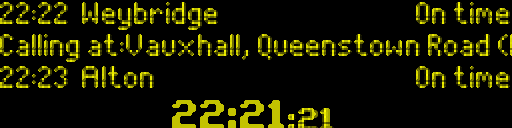

# UK train departure screen

> Python script to display replica real-time UK railway station departure screens for SSD13xx devices

## Sample output



## Usage

1. Clone this repo

2. Install dependcies

```bash
$ pip install -r requirements.txt
```

3. Sign up for the [Transport API](https://www.transportapi.com/), and generate an app ID and API key

4. Copy `config.sample.json` to `config.json` and complete the values, including your Transport API keys from step 3. Note: station names should be provided as their three-letter station code, all available [here](https://www.nationalrail.co.uk/stations_destinations/48541.aspx).

5. Start the app with:

```bash
$ python ./src/main.py --display pygame --width 256 --height 64

```

Change the `--display` flag to alter the output mechanism (a list of options can be found in this README: https://github.com/rm-hull/luma.examples). Use `capture` to save to images, and `pygame` to run a visual emulator.

Remember to pass `--interface spi` if you are using SPI to communicate with your screen. Otherwise, the default of `i2c` should suffice.

```bash
$ python ./src/main.py --display ssd1322 --width 256 --height 64 --interface spi
```

## Thanks

The fonts used were painstakingly put together by `DanielHartUK` and can be found on GitHub at https://github.com/DanielHartUK/Dot-Matrix-Typeface - A huge thanks for making that resource available!
