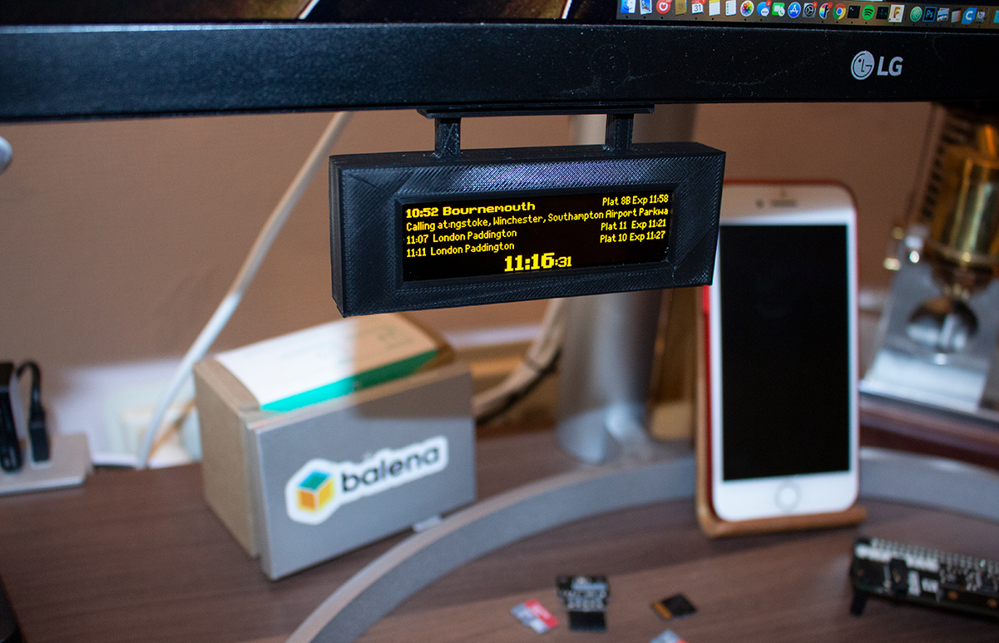
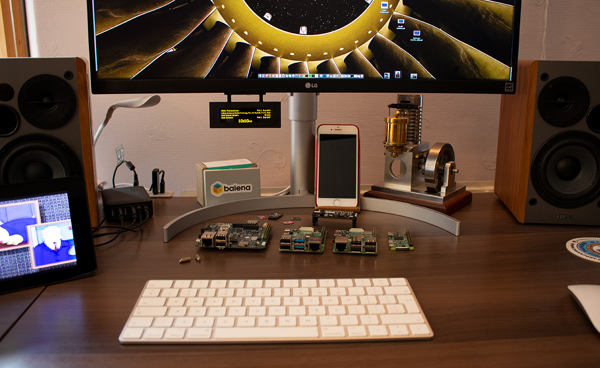

# UK Train Departure Display (next train indicator)




A set of python scripts to display replica near real-time UK railway station departure data on one or two SSD1322-based 256x64 SPI OLED screens. Uses the publicly available [OpenLDBWS API by National Rail Enquiries](https://www.nationalrail.co.uk/). This project has been developed and simplified based on the work of [others](#credits) to run on the [balenaCloud](https://balena.io/cloud) platform.

   * [Installation](#installation)
   * [Configuration](#configuration)
   * [Hardware](#hardware)
   * [Credits](#credits)

## Installation

Running this project is as simple as deploying it to a balenaCloud fleet. You can do it in just a few clicks by using the button below:

[](https://dashboard.balena-cloud.com/deploy?repoUrl=https://github.com/balenalabs/uk-train-departure-display&defaultDeviceType=raspberry-pi)

Alternatively, sign up, add a fleet and device as per the [getting started](https://www.balena.io/docs/learn/getting-started/raspberrypi3/python/) guide. Then use the [balena CLI](https://github.com/balena-io/balena-cli) to push the project to your Pi.

This allows you to easily deploy multiple devices and configure them from the dashboard with the following variables.

**There is also [a full writeup on the balena blog](https://www.balena.io/blog/build-a-raspberry-pi-powered-train-station-oled-sign-for-your-desk/).**


## Configuration

Sign up for the [National Rail Enquiries OpenLDBWS API](http://realtime.nationalrail.co.uk/OpenLDBWSRegistration), which will generate an token for you to use as the API key.

These environment variables are specified using the [balenaCloud dashboard](https://www.balena.io/docs/learn/manage/serv-vars/), allowing you to set up mutiple signs in one fleet for different stations.


| Key                              | Example Value
|----------------------------------|----------
|`TZ`  | `Europe/London` ([timezone](https://en.wikipedia.org/wiki/List_of_tz_database_time_zones))
|`departureStation`  | `PAD` ([station code](https://www.nationalrail.co.uk/stations_destinations/48541.aspx))
|`destinationStation`  | `HWV` ([station code](https://www.nationalrail.co.uk/stations_destinations/48541.aspx)) [optional] Filters trains shown to only those that call at this station
|`departurePlatform` | `7` (filter departures shown to only those departing from this platform)
|`timeOffset`  | `5` [optional] (Time offset, in minutes, for the departure board. Can be used to see into the future (positive value) or past (negative value). Set 5 if you live 5 min from the station and want to hide departures that are too soon to catch)
|`refreshTime` | `120` (seconds between data refresh)
|`screenRotation` | `2` (rotates the output of the OLED)
|`apiKey` | `f1ff949c-769e-49b3-8242-eee54fe91b94` (OpenLDBWS API key)
|`operatingHours` | `8-22` (hours during which the data will refresh at the interval above)
|`screenBlankHours` | `1-6` (hours during which the screen will be blank and data will not refresh)
| `outOfHoursName` | `London Paddington` (name shown when current time is outside the `operatingHours`)
| `dualScreen` | `True` (if you are using two displays)
| `screenPlatform1` | `1` (sets the platform you want to have displayed on the first display)
| `screenPlatform2` | `2` (sets the platform you want to have displayed on the second display)


If using multi screen the following line needs to be added into /boot/config.txt

```
dtoverlay=spi1-3cs
```

This can be achieved by using the [Advanced boot settings](https://www.balena.io/docs/reference/OS/advanced/) specified from the device configuration screen in the balenaCloud dashboard.

## Hardware

This project (without modification) requires the use of a SSD1322-based 256x64 SPI display, an OLED in yellow for the authentic look. I have used [displays from AliExpress](https://www.aliexpress.com/item/32988174566.html) successfully. 

The connections for one of these displays to the Raspberry Pi GPIO header are as follows, but **it would be a good idea to check the connections with the datasheet of your particular display before powering on** as there's no guarantee yours will match the pinout of mine.

| Display | Connection | Raspberry Pi
|---|---|---
| 1 | Ground | 6 (Ground) |
| 2 | V+ (3.3V) | 1 (3v3 Power) |
| 4 | `D0/SCLK` | 23 (`BCM11 SCLK`) |
| 5 | `D1/SDIN` | 19 (`BCM10 MOSI`) |
| 14 | `DC` (data/command select) | 18 (`BCM24`) |
| 15 | `RST` (reset) | 22 (`BCM25`) |
| 16 | `CS` (chip select) | 24 (`BCM8 CE0`)

| Second Display | Connection | Raspberry Pi
|---|---|---
| 1 | Ground | 25 (Ground) |
| 2 | V+ (3.3V) | 17 (3v3 Power) |
| 4 | `D0/SCLK` | 40 (`BCM21 SCLK`) |
| 5 | `D1/SDIN` | 38 (`BCM20 MOSI`) |
| 14 | `DC` (data/command select) | 29 (`BCM5`) |
| 15 | `RST` (reset) | 31 (`BCM6`) |
| 16 | `CS` (chip select) | 12 (`BCM18 CE0`)


**Important note, if your display isn't working check this first!:** Some displays have a solder-blob or zero-ohm resistor jumper on the back of the board that you may need to move in order to enable the display for SPI communication. If you don't get any output, check this first! In the case of my display it meant moving `R6` to `R5` to enable 4SPI as dictated by a small data table printed on the back of the display board.

## Case

There are .stl 3D models for a case available in the assets directory.

## Credits

A big thanks to [Chris Hutchinson](https://github.com/chrishutchinson/) who originally started this project and inspired me to develop it further. [Blake](https://github.com/ghostseven) made some further improvements and this project was forked from [there](https://github.com/ghostseven/UK-Train-Departure-Display).

The fonts used were painstakingly put together by `DanielHartUK` and can be found on GitHub at https://github.com/DanielHartUK/Dot-Matrix-Typeface - A huge thanks for making that resource available!

Thanks to [@jajasilver](https://github.com/jajsilver/UK-Train-Departure-Display-NRE) and [@MatthewAscough](https://github.com/MatthewAscough/UK-Train-Departure-Display-NRE) for forming the basis of the OpenLDBWS implementation.
