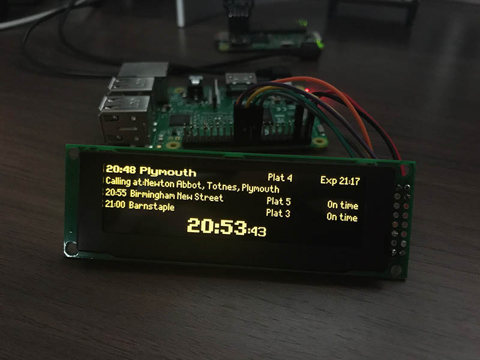
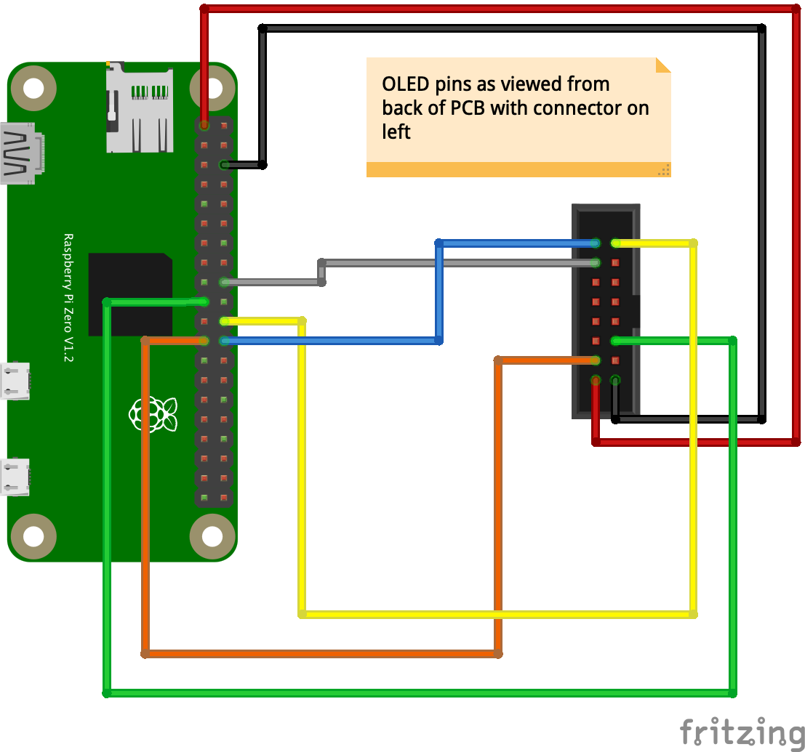

# Balena UK Train Departure Display (next train indicator)

A set of python scripts to display replica near real-time UK railway station departure data on SSD1322-based 256x64 SPI OLED screens. Uses the publicly available [Transport API](https://www.transportapi.com/). This project has been developed and simplified based on the work of [others](#credits) to run on the [balenaCloud](https://balena.io/cloud) platform.

   * [Installation](#installation)
   * [Configuration](#configuration)
   * [Hardware](#hardware)
   * [Credits](#credits)

## Installation

A Dockerfile template is included in order to run this project on the balenaCloud platform.

To use this project, sign up, add an application and device as per the [getting started](https://www.balena.io/docs/learn/getting-started/raspberrypi3/python/) guide. Then use the [balena CLI](https://github.com/balena-io/balena-cli) to push the project to your Pi.

This allows you to easily deploy multiple devices and configure them from the dashboard with the following variables which will then automatically generate the `config.json` file required.

**There is also [a full writeup on the balena blog](https://www.balena.io/blog/build-a-raspberry-pi-powered-train-station-oled-sign-for-your-desk/).**

## Configuration

Sign up for the [Transport API](https://www.transportapi.com/), and generate an app ID and API key (note the free tier has a limit of 1000 requests a day).

These environment variables are specified using the [balenaCloud dashboard](https://www.balena.io/docs/learn/manage/serv-vars/), allowing you to set up mutiple signs in one application for different stations.

| Key                              | Example Value
|----------------------------------|----------
|`TZ`  | `Europe/London` ([timezone](https://en.wikipedia.org/wiki/List_of_tz_database_time_zones))
|`departureStation`  | `PAD` ([station code](https://www.nationalrail.co.uk/stations_destinations/48541.aspx))
|`destinationStation`  | `HWV` ([station code](https://www.nationalrail.co.uk/stations_destinations/48541.aspx)) [optional] Filters trains shown to only those that call at this station
| `outOfHoursName` | `London Paddington` (name shown when current time is outside the `transportApi_operatingHours`)
|`refreshTime` | `120` (seconds between data refresh)
|`transportApi_apiKey` | `798c7ddfdeadbeef87987e9a8e79` (transport API key)
|`transportApi_appId` | `12345678` (transport API application ID)
|`transportApi_operatingHours` | `8-22` (hours during which the data will refresh at the interval above)

## Hardware

This project (without modification) requires the use of a SSD1322-based 256x64 SPI display, an OLED in yellow for the authentic look. I have used [displays from AliExpress](https://www.aliexpress.com/item/32988174566.html) successfully.

The connections for one of these displays to the Raspberry Pi GPIO header are as follows, but **it would be a good idea to check the connections with the datasheet of your particilar display before powering on** as there's no guarantee yours will match the pinout of mine.

| Display | Connection | Raspberry Pi
|---|---|---
| 1 | Ground | 6 (Ground) |
| 2 | V+ (3.3V) | 1 (3v3 Power) |
| 4 | `D0/SCLK` | 23 (`BCM11 SCLK`) |
| 5 | `D1/SDIN` | 19 (`BCM10 MOSI`) |
| 14 | `DC` (data/command select) | 18 (`BCM24`) |
| 15 | `RST` (reset) | 22 (`BCM25`) |
| 16 | `CS` (chip select) | 24 (`BCM8 CE0`)

## Case

There are .stl 3D models for a case available in the assets directory.

## Credits

A big thanks to [Chris Hutchinson](https://github.com/chrishutchinson/) who originally started this project and inspired me to develop it further. [Blake](https://github.com/ghostseven) made some further improvements and this project was forked from [there](https://github.com/ghostseven/UK-Train-Departure-Display).

The fonts used were painstakingly put together by `DanielHartUK` and can be found on GitHub at https://github.com/DanielHartUK/Dot-Matrix-Typeface - A huge thanks for making that resource available!
