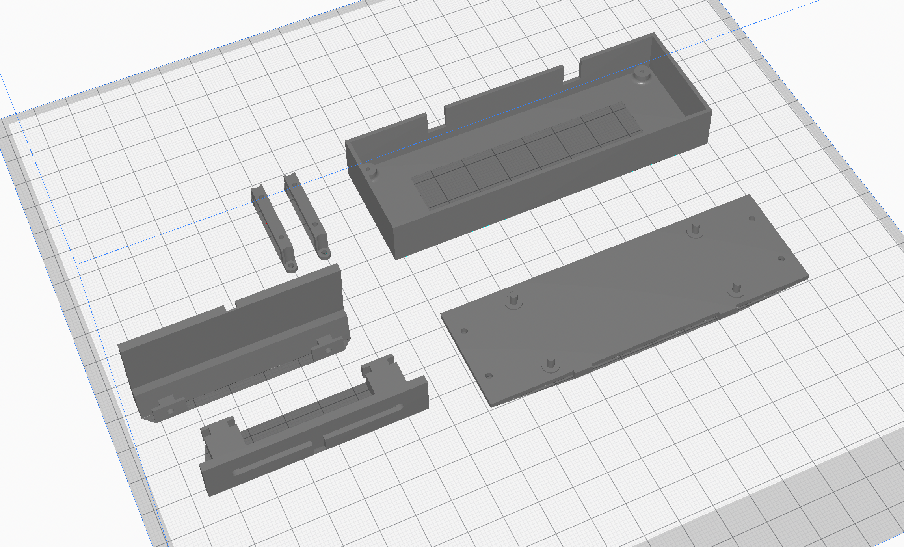

# Getting started

This project is designed to be easily reproducible by anyone with basic hardware assembly skills. Of course, you can reproduce the project exactly as designed, but you can also forego certain features in the interests of making it easier to assemble.

I have detailed the process of reproducing the project and building a unit exactly as I have done for myself, but you can definitely simplify the project if you don't want the same custom case.

**Solding not required!** Although in the *ideal* setup, the connections between the display and the Raspberry Pi would be soldered in order to keep the profile of the two boards as low as possible without header pins, it is totally possible to make the connections using jumper-jerky/dupont wires and avoid the need to solder anything.

## Hardware required

   * 1x Raspberry Pi Zero 2 W (recommended) or Zero W
   * 1x Micro SD card (recommend Sandisk Ultra 8GB or larger)
   * 1x 2.8" SSD1322-based 256x64 SPI display (sample link below)
   * 1x 3D printed [case body](../case/case-body.stl)
   * 1x 3D printed [back cover](../case/back-cover.stl)
   * 2x 3D printed [display clamp](../case/display-clamp.stl)
   * 1x 3D printed [desk mount](../case/desk-mount.stl) *OR* [hanging mount](../case/hanging-mount.stl)
   * 4x M1.2x4mm self tapping screws to mount the display with the clamps
   * 4x M1.7x5mm self tapping screws to fit the back cover
   * 1x Power cable (e.g. a USB cable that can be cut)
   * Various small wires for connecting the Pi to the display; plain wires if you're soldering, otherwise jumper-jerky/dupont wires

For the screws, I usually purchase screw sets [like this from Amazon](https://www.amazon.co.uk/gp/product/B0915DPHV2) which last a while and provide for many different projects.

I have used [displays from AliExpress](https://www.aliexpress.com/item/32988174566.html) successfully, but any other with the same pixel dimensions and controller chip should also work.

This project is designed to run using a Raspberry Pi Zero W or Zero 2 W and therefore the case is designed to fit that device. If you intend to create your own case or not use a case, other Raspberry Pi devices will also work.

## Software required

- Software to flash an SD card ([balenaEtcher](https://balena.io/etcher))
- A free [balenaCloud](https://balena.io/cloud) account
- A free [National Rail Enquiries OpenLDBWS API](http://realtime.nationalrail.co.uk/OpenLDBWSRegistration) account
- (optional) A download of this project
- (optional) The [balena CLI tools](https://github.com/balena-io/balena-cli/blob/master/INSTALL.md)

This project has been built to be deployed using a free [balenaCloud](https://dashboard.balena-cloud.com) account. BalenaCloud allows you to deploy and update the project software in just a few clicks and takes all of the hassle out of installing and configuring software. 

## Installation

Once you have the free account set up, running this project is as simple as deploying it to a balenaCloud fleet. The basic premise is that you add a fleet, add your device (or devices - you can have more than one device running the same code!), and then deploy software. You can do it in just a few clicks by using the button below which will automatically guide you through adding your first fleet and deploying the code.

Once your SD card has been flashed, set it aside as we'll need it later after we have assembled the hardware.

To update at a later date, simply return to this page and click the above button again to deploy the latest code to your existing fleet. Your device will automatically update over-the-air!

**Alternatively**, sign up, add a fleet and device as per the [getting started](https://www.balena.io/docs/learn/getting-started/raspberrypi3/python/) guide. Then use the [balena CLI](https://github.com/balena-io/balena-cli) to push the project to your Pi.

This allows you to easily deploy multiple devices and configure them from the dashboard with the following variables.

## Printing the case

For printing I recommend orientating the parts as below, noting that the hanging mount will require supports, although I also recommend blocking the supports from filling the holes - they can be tough to remove and should print OK without support.

You should find that the case body prints slightly larger than necessary for the OLED to fit, the reason for this is to give you the freedom to center the display within the window on the front. I have found that the displays vary slightly when it comes to location of the display panel itself and sometimes are not centered.

**Next up: [Connecting the display to the Pi](./02-connecting-the-display-to-the-pi.md)**