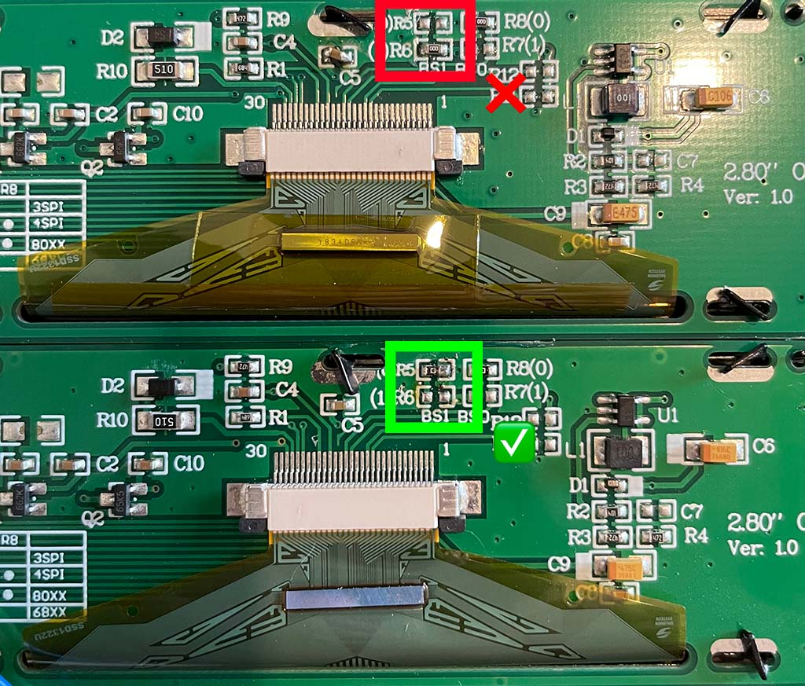
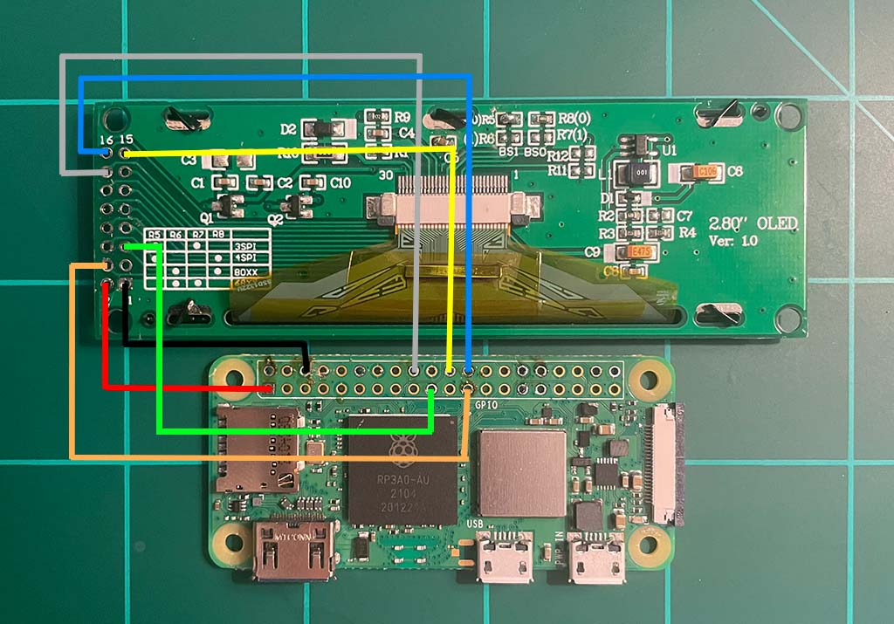
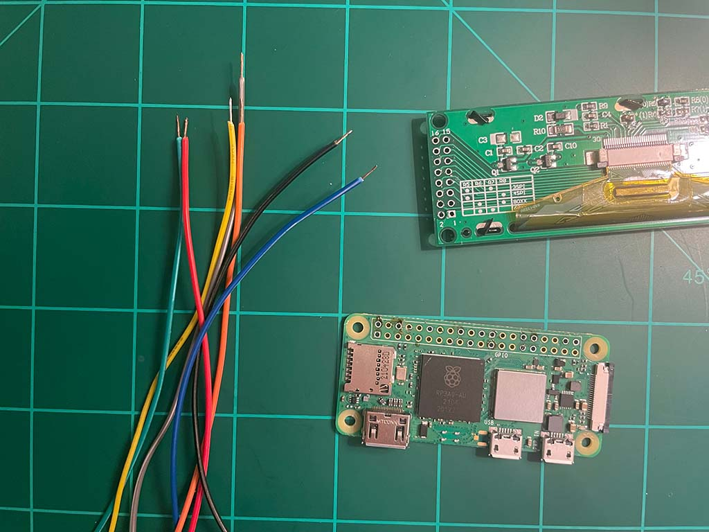
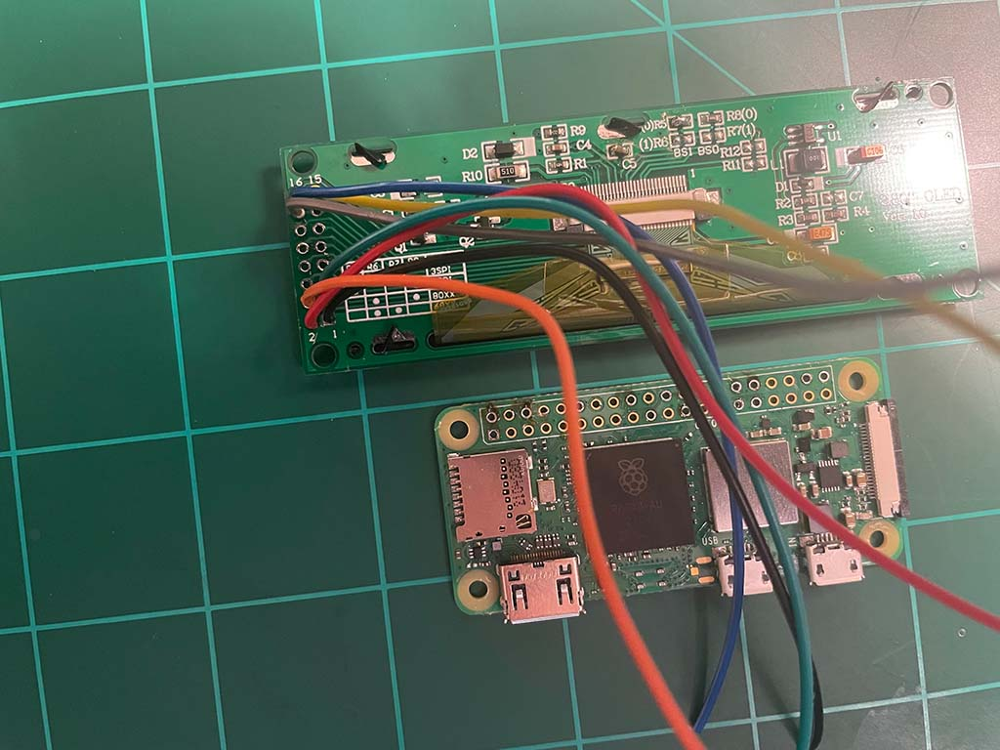
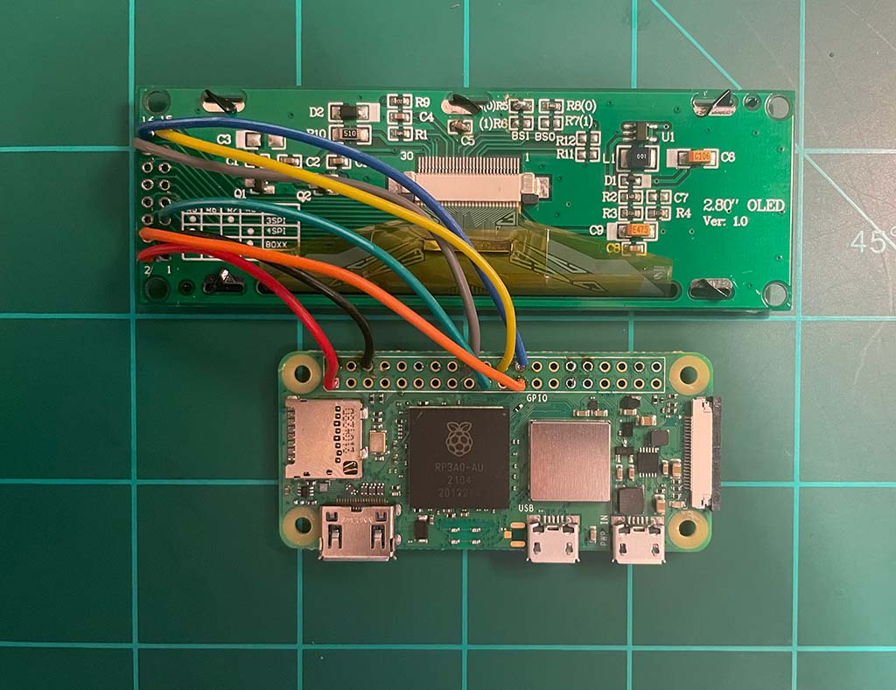

# Connecting the display to the Pi

The next thing we need to tackle once you have obtained what you need from the [hardware required](01-getting-started.md#hardware-required) list is connecting the display to the Raspberry Pi and assembling the case.

## Configuring the display

Some displays have a solder-blob or zero-ohm resistor jumper on the back of the board that you may need to move in order to enable the display for SPI communication. In the case of my display it meant moving `R6` to `R5` to enable 4SPI as dictated by a small data table printed on the back of the display board. This may not be necessary if you get a different display, but it has been for every display I have used so far.

**Note:** this resistor is of zero value, so if it's easier you can remove it from one position and just bridge the pads with solder instead. A user also reported it's possible to do this with conductive paint in the case you are building the project without soldering.

## Required connections

The connections for one of these displays to the Raspberry Pi GPIO header are as follows, but **it would be a good idea to check the connections with the datasheet of your particular display before powering on** as there's no guarantee yours will match the pinout of mine.

### Display 1

| Display | Connection | Raspberry Pi
|---|---|---
| 1 | Ground | 6 (Ground) |
| 2 | V+ (3.3V) | 1 (3v3 Power) |
| 4 | `D0/SCLK` | 23 (`BCM11 SCLK`) |
| 5 | `D1/SDIN` | 19 (`BCM10 MOSI`) |
| 14 | `DC` (data/command select) | 18 (`BCM24`) |
| 15 | `RST` (reset) | 22 (`BCM25`) |
| 16 | `CS` (chip select) | 24 (`BCM8 CE0`)

### Display 2 (optional)
| Display 2 | Connection | Raspberry Pi
|---|---|---
| 1 | Ground | 25 (Ground) |
| 2 | V+ (3.3V) | 17 (3v3 Power) |
| 4 | `D0/SCLK` | 40 (`BCM21 SCLK`) |
| 5 | `D1/SDIN` | 38 (`BCM20 MOSI`) |
| 14 | `DC` (data/command select) | 29 (`BCM5`) |
| 15 | `RST` (reset) | 31 (`BCM6`) |
| 16 | `CS` (chip select) | 12 (`BCM18 CE0`)

## Making the connections

The idea when making the connections between the display and the Raspberry Pi is to be as neat as possible and keep the wires only as long as necessary. Space within the case is limited and any extra wiring may make it difficult to fit all of the components in.

Strip the ends of each wire and make all the connections to the display first. I used the same colour wires as in my wiring diagram to save confusion.

Next, connect each of the wires to the appropriate place on the Pi, working from left to right. Again, make sure wires are only as long as necessary to make the connection.

## Testing

At this point you can install the SD card into the Pi and power it up. If you've connected everything correctly you should see the initial welcome screen of the display, but nothing more since we haven't configured it yet (that comes later!).

## Troubleshooting

If at this point you're not seeing the Train Departure Display welcome screen, don't worry, just double check all of your connections one by one, and review the note at the beginning of this guide about the resistor/solder-blob configuration. It can be different per-display, and we need to make sure the display is set to 4-wire SPI mode before it will work.

**Next up: [Assembling the case](./03-assembling-the-case.md)**