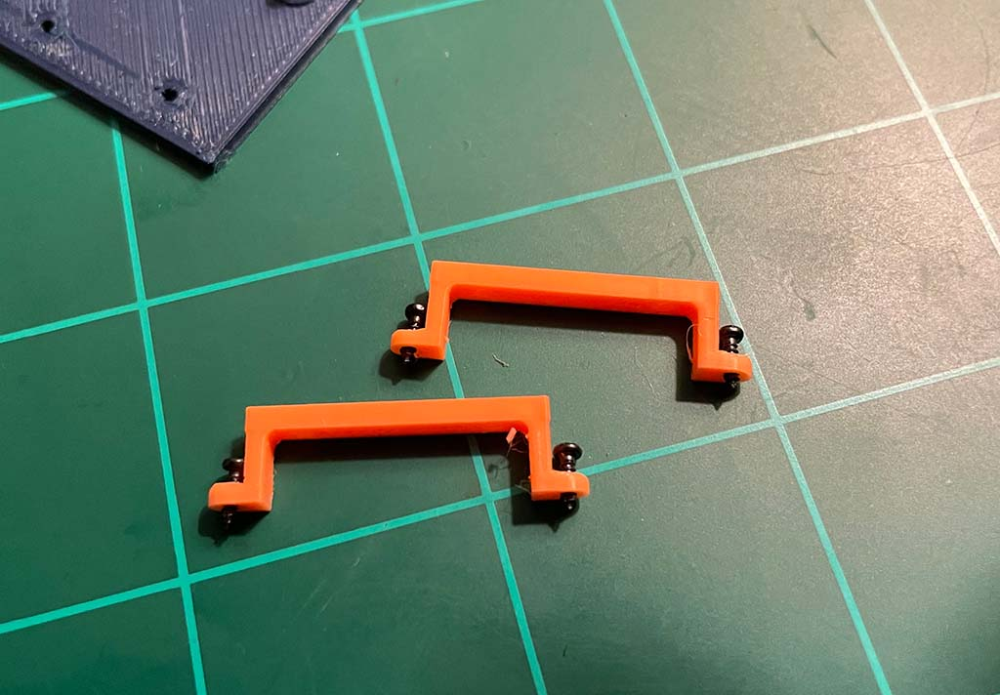
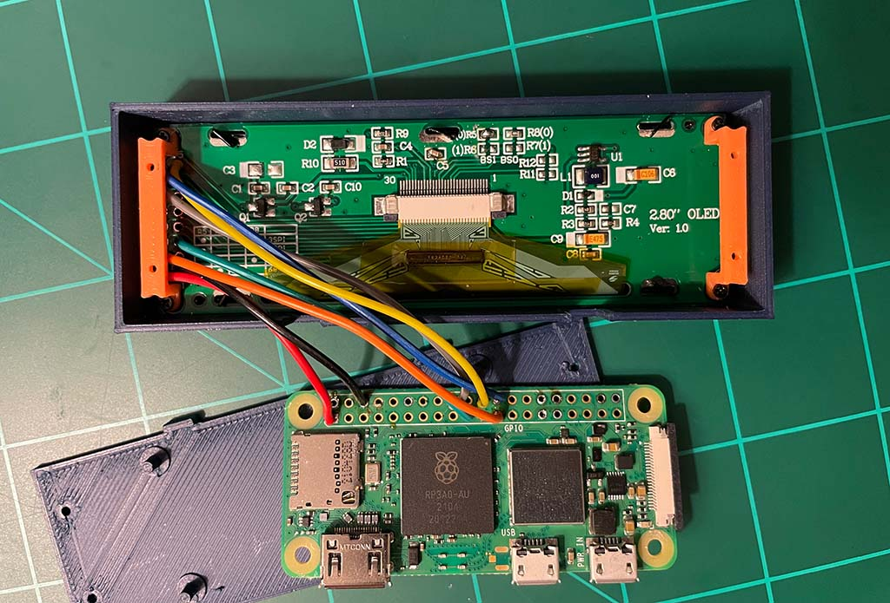
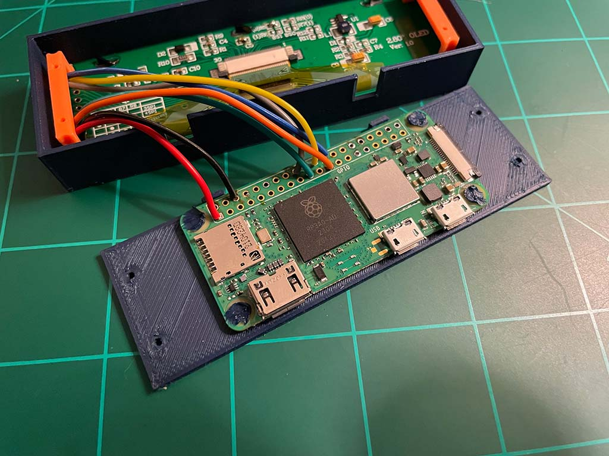
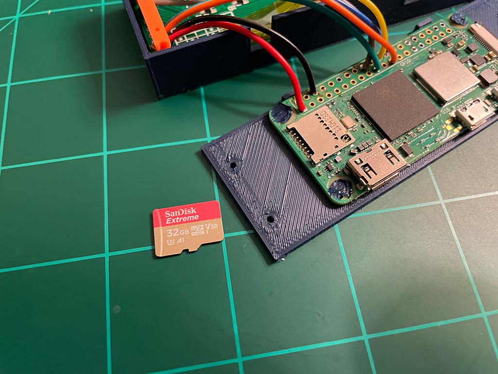
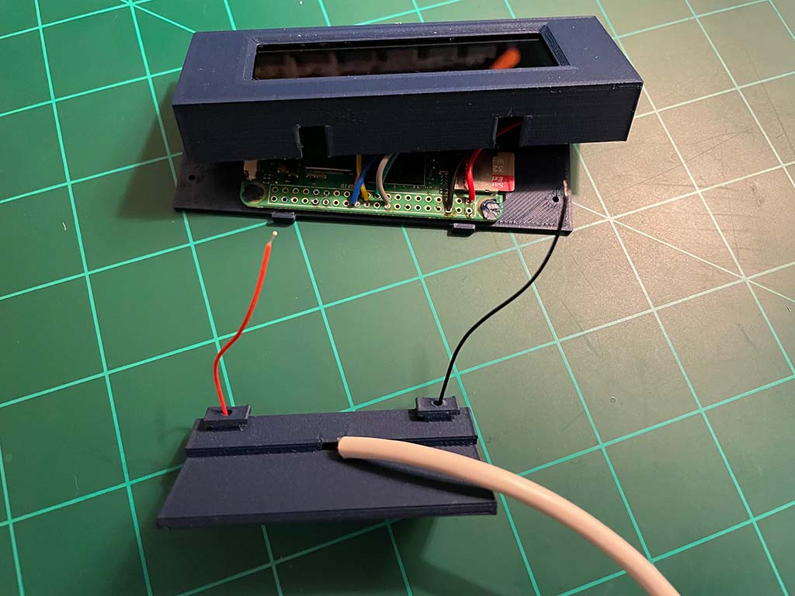
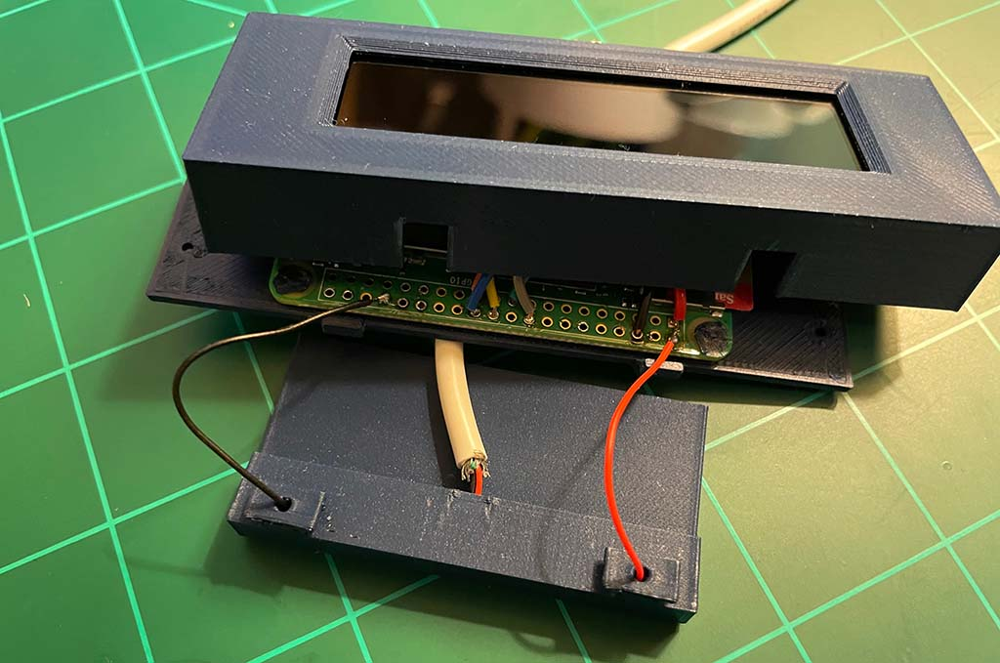
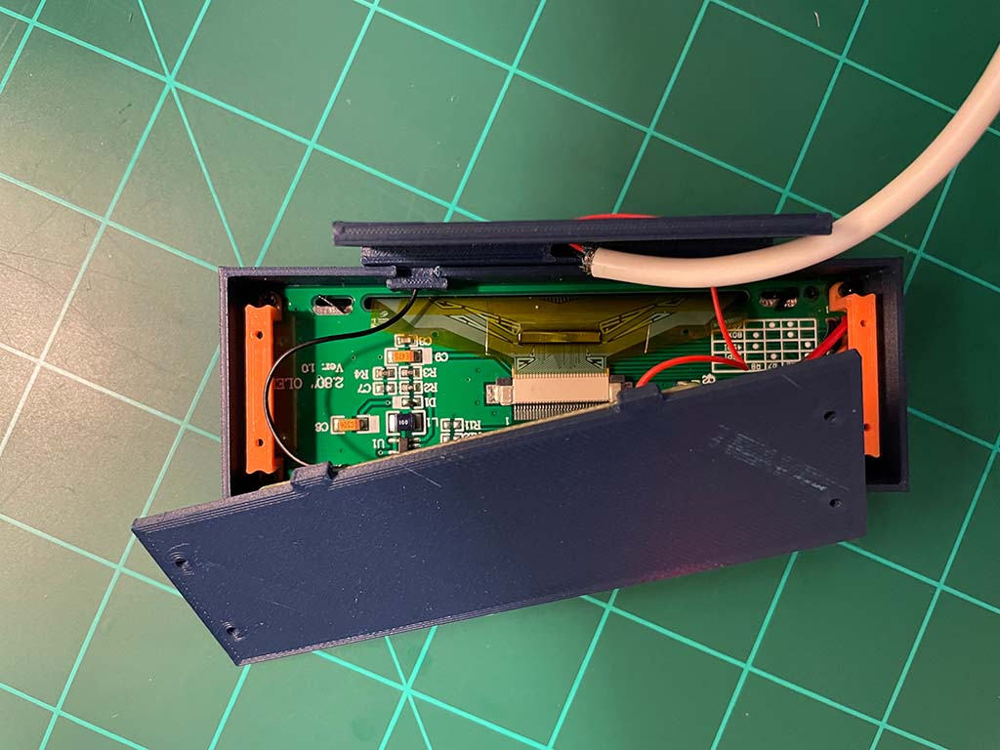
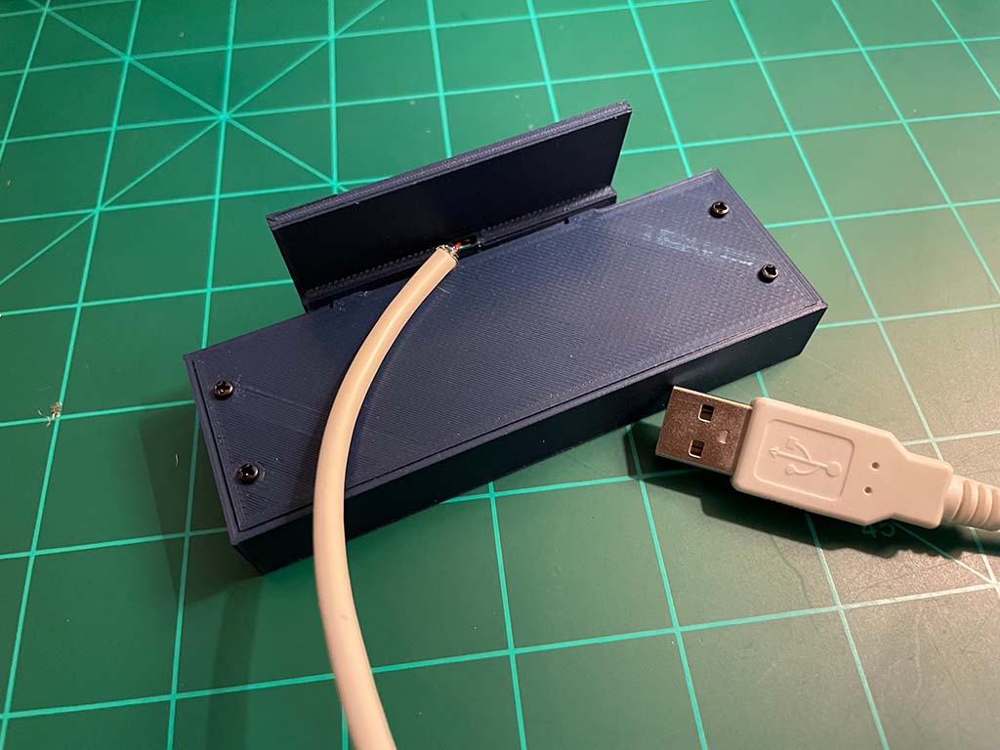

# Assembling the case

Once you've [connected the display to the Pi](./02-connecting-the-display-to-the-pi.md) and confirmed it's working, and I do recommend doing that first, it's time to assemble everything in the case.

## Securing the display

The display is held into the case body using two display clamps. The display should be a somewhat loose fit into the case body to allow for you to center the display within the window given variances in displays that I've observed.

Use 4x M1.2x4mm self tapping screws (the smaller of the two sizes) to secure the clamps and the display. Gently tighten them as the screws are very small and prone to either stripping the threads or snapping.

## Securing the Pi

Next, the Pi should be secured to the back cover. This is achieved by placing the Pi onto the 4 mounting posts and then melting the posts flat with a soldering iron. The 3D-printed plastic melts easily to fill the holes in the Pi PCB. The approach should be to flatten the posts out over the hole to provide a secure mounting.

Now's a good time to install your SD card again (if necessary) as it will become more difficult to do so as we continue with the assembly of the case.

## Power cable and mounting

Next, we need a method of powering the device. There are holes in both the desk mount and the hanging mount that allow you to pass through two wires, a positive and negative connection, in order to power the Pi and the display.

As noted in the parts list, I used a USB cable I could cut open for this purpose, but really you could use any 5V power supply as long as the wires are thin enough. If you cut open a cable be sure to test the wires using a multimeter to ensure that they are color coded as you expect. Don't rely on red and black to be positive and negative.

First route the wires through your chosen mounting, noting that the positive and negative need to be placed as pictured for the easiest and tidiest connection to the Pi.

Next, position the case and Pi as pictured below, and solder the power wires to the Pi.

Connect the positive (+5V) wire to pin 2 on the Pi and connect the ground wire to any ground pin available (I used pin 34).

## Closing the case

Finally, the last part of the assembly is to install the back cover of the case using 4x M1.7x5mm self tapping screws.

Ensure that all wires are neatly fitted within the case and do not cover the clamps in any way.

**Next up: [Configuration](./04-configuration.md)**