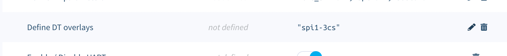

# Configuration

Sign up for the [National Rail Enquiries OpenLDBWS API](http://realtime.nationalrail.co.uk/OpenLDBWSRegistration), which will generate an token for you to use as the API key.

Only the API key is required to make the project run, everything else is optional but of course it may make sense for you to at least choose your preferred your station.

These environment variables are specified using the [balenaCloud dashboard](https://www.balena.io/docs/learn/manage/serv-vars/), allowing you to set up mutiple signs in one fleet for different stations.

| Key                              | Example Value
|----------------------------------|----------
|`apiKey` **(REQUIRED for National Rail)** | `xxxxxxxx-xxxx-xxxx-xxxx-xxxxxxxxxxxx` (OpenLDBWS API key)
|`mode`  | `nationalrail` (default) for National Rail departures, or `tube` for live London Underground / DLR arrivals from the TfL Unified API
|`TZ`  | `Europe/London`, will default to UTC if not set ([timezones](https://en.wikipedia.org/wiki/List_of_tz_database_time_zones))
|`departureStation`  | `PAD` ([station code](https://www.nationalrail.co.uk/stations_destinations/48541.aspx)) in National Rail mode, or a TfL StopPoint / Naptan id such as `940GZZLUKSX` in tube mode
|`destinationStation`  | `HWV` ([station code](https://www.nationalrail.co.uk/stations_destinations/48541.aspx)) [optional] Filters trains shown to only those that call at this station. This can be multiple stations seperated by a comma. eg. PAD, KGX, STP
|`timeOffset`  | `5` [optional] (Time offset, in minutes, for the departure board. Can be used to see into the future (positive value) or past (negative value). Set 5 if you live 5 min from the station and want to hide departures that are too soon to catch)
|`refreshTime` | `120` (seconds between data refresh)
|`screenRotation` | `2` (rotates the output of the OLED, 0 for when using the desk stand, 2 for the monitor mount ([docs](https://luma-oled.readthedocs.io/en/latest/api-documentation.html#luma.oled.device.ssd1322)))
|`operatingHours` | `8-22` (hours during which the data will refresh at the interval above - leave blank to run all day)
|`screenBlankHours` | `1-6` (hours during which the screen will be blank and data will not refresh - leave blank to never blank)
| `outOfHoursName` | `London Paddington` (name shown when current time is outside the `operatingHours`)
| `dualScreen` | `True` (if you are using two displays)
| `screen1Platform` | `1` (sets the platform you want to have displayed on the first or single-screen display)
| `screen2Platform` | `2` (sets the platform you want to have displayed on the second display)
| `individualStationDepartureTime` | `False` (Displays the estimated or scheduled time of the service at each leg of a journey)
| `numericPlatformsOnly` | `False` This will only show numeric platforms, some stations may have local services that use alphabetic stations for local services (this will remove stations like 3A, 4B).
| `fpsTime` | `4` (adjusts how often the effective FPS is displayed)
| `headless` | `True` (outputs to noop serial device rather than serial port; useful for running on a development machine)
| `showDepartureNumbers` | `True` (adds 1st / 2nd / 3rd as per UK train departures)
| `firstDepartureBold` | `False` (makes the first departure use either the bold or normal font)
| `targetFPS` | `20` (Frame rate regulator FPS target; 0 disables the regulator, which will increase FPS on constrained CPU, but will run the CPU hot at 100%.)
| `debug` | `False` (Display debugging information; `True` shows the debug info permanently, any integer `>1` will show instead of the splash screen for that number of seconds)

## London Underground / DLR (tube mode)

Set `mode` to `tube` to show live London Underground, DLR, London Overground and Elizabeth line arrivals from the free [TfL Unified API](https://api.tfl.gov.uk/) instead of National Rail departures. The `apiKey` is not required in this mode.

| Key | Example Value
|-----|----------
| `mode` | `tube`
| `departureStation` | `940GZZLUKSX` (a TfL StopPoint / Naptan id; look one up via the [TfL StopPoint search](https://api.tfl.gov.uk/StopPoint/Search/King%27s%20Cross))
| `tflAppKey` | `xxxxxxxxxxxxxxxxxxxxxxxxxxxxxxxx` [optional] a TfL application key, which raises the API rate limits. Not required, but recommended for always-on displays
| `tubeLine` | `Northern` [optional] restricts the board to a single line, since a station can serve several. The value matches the TfL line name, so it also works for DLR (`DLR`), the Elizabeth line (`Elizabeth line`) and the newer named Overground lines (`Mildmay`, `Windrush`, `Lioness`, `Suffragette`, `Weaver`, `Liberty`)
| `tubeDirection` | `southbound` [optional] restricts the board to a single direction. Accepts the TfL direction (`inbound` / `outbound`) or a compass word (`westbound` / `eastbound` / `northbound` / `southbound`). For example, at Camden Town (`940GZZLUCTN`) on the `Northern` line, `southbound` shows both branches interleaved by arrival time — trains towards `Morden via Bank` alongside `Kennington via CX` and `Battersea via CX` (CX = Charing Cross)

Notes for tube mode:

- TfL provides live arrival predictions rather than a fixed timetable, so departures are ordered by how soon each train arrives and all services show as `On time`.
- The Underground does not expose downstream calling points, so the scrolling line beneath the first departure shows its platform and live train location instead (e.g. "Southbound - Platform 2  --  Between Camden Town and Euston").
- **Branch lines** (e.g. Northern, District, Metropolitan): both branches are shown interleaved in arrival order and are told apart by their destination text (e.g. "Morden via Bank" vs "Morden via Charing Cross"). Leave `tubeDirection` set to a single value to keep both branches.
- **DLR, London Overground and the Elizabeth line**: their platforms are not labelled with a compass direction (you'll see `Platform 1`, `Platform Unknown` etc.), so a compass `tubeDirection` such as `southbound` will match nothing and leave the board blank. Use `inbound` / `outbound` instead, or leave `tubeDirection` blank. For example, Acton Central (`910GACTNCTL`) on the `Mildmay` line reports `Platform 1` / `Platform 2` with `outbound` trains towards Richmond and `inbound` trains towards Willesden Junction.
- **Circle line** (and other loop / terminating services): TfL often reports no direction at all for these, so any `tubeDirection` filter will hide them. Leave `tubeDirection` blank on the Circle line.
- `destinationStation` filtering and `timeOffset` only apply to National Rail mode.

If using two screens the following line needs to be added into /boot/config.txt which is achieved by using the 'Define DT overlays' option within the Device configuration screen on balenaCloud: `spi1-3cs`

